# Hey there :wave:

**Intro**

- :open_book: Education 
  {Bachelor, Mixed Class (Chu Kochen Honors College) & Computer Science => Master, Computer Science} @ Zhejiang University  
- :hammer_and_wrench: Research Focus 
  High-Frequency Trading, Quantitative Finance, Operating System, Blockchain & Smart Contract  
- :balloon: Hobbies 
  :badminton:, :tennis:, :bicyclist:, :small_airplane: and :video_game: (:peace_symbol::gear:, :red_circle::dragon_face:, :chess_pawn:)

**My GitHub Metrics**

**Coding Time**

**Other Stats**

<!--
### Languages

### Github Stats

### Coding

-->

<!--
"ayu-mirage": {
    title_color: "f4cd7c",
    icon_color: "73d0ff",
    text_color: "c7c8c2",
    bg_color: "1f2430",
}
-->

<!--
### Misc

 -->

<!--  -->
